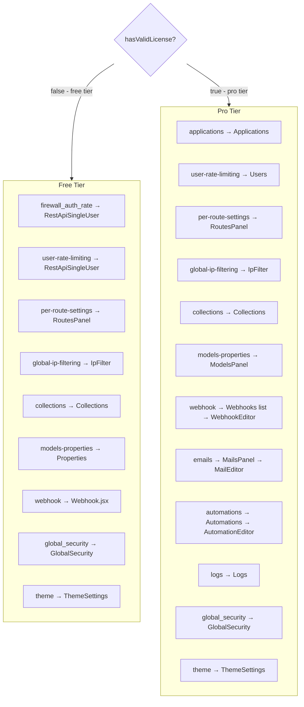
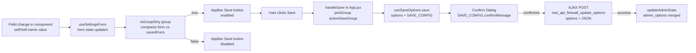
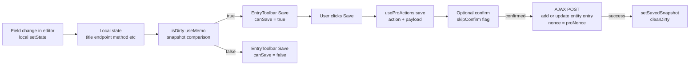

# REST API Firewall – Architecture Map

> Companion to SKILL.md. Purpose: prevent regressions when working across free/pro tiers.
> After any UI change, run the relevant regression checklist at the bottom of this file.

---

## 1 — Panel Registry

Every panel key, which tier sees it, which component renders, and which save routine it uses.

| Panel key | Free component | Pro component | Save routine | PHP group |
|---|---|---|---|---|
| `firewall_auth_rate` | `RestApiSingleUser` | `RestApiSingleUser` | AppBar (free) / AppBar (pro) | `firewall_auth_rate` |
| `user-rate-limiting` | `RestApiSingleUser` | `Users` | AppBar (free) / EntryToolbar (pro) | `firewall_auth_rate` |
| `per-route-settings` | `RoutesPanel` | `RoutesPanel` | AppBar (free) / AppBar (pro) | `firewall_routes_policy` |
| `global-ip-filtering` | `IpFilter` | `IpFilter` | Per-row (IP entries) + **Public Rate Limiting self-contained** | — / `public_rate_limit` |
| `collections` | `Collections` | `Collections` | Inline per-type (free) / Inline per-type (pro, DataGrid→CollectionEditor) | `collections` |
| `models-properties` | `Properties` | `ModelsPanel` | AppBar (free) / EntryToolbar (pro) | `models_properties` |
| `wp-settings` | `WpSettingsPanel` | `WpSettingsPanel` | AppBar (free) / — (pro, self-manages via ModelEditor) | `wp_settings` |
| `webhook` | `Webhook` | `Webhooks` (list) → `WebhookEditor` | AppBar (free) / EntryToolbar (pro) | `webhook` |
| `emails` | — (pro only) | `MailsPanel` → `MailEditor` | — / EntryToolbar | — |
| `automations` | — (pro only) | `Automations` → `AutomationEditor` | — / EntryToolbar | — |
| `logs` | — (pro only) | `Logs` | — | — |
| `applications` | — (pro only) | `Applications` | — | — |
| `global_security` | `GlobalSecurity` | `GlobalSecurity` | Inline Toolbar (self-contained) | `global_security` |
| `theme` | `ThemeSettings` | `ThemeSettings` | AppBar (both) | `theme` |
| `license` | `License` | `License` | — | — |
| `configuration` | `ConfigurationPanel` | `ConfigurationPanel` | — | — |

**Save routine key:**
- **AppBar** = `showSaveButton` in `PANEL_SAVE_GROUP` (App.jsx) → Navigation AppBar button → `useSaveOptions`
- **EntryToolbar** = `useRegisterToolbar` in editor → EntryToolbar replaces AppBar → `useProActions`
- **Inline Toolbar** = component owns its own `<Toolbar>` + `useSaveOptions` (only GlobalSecurity)
- **Inline per-type** = component owns its own inline Save button scoped to the selected type, NOT in `PANEL_SAVE_GROUP` (only Collections)

**Self-contained panels (NOT in `PANEL_SAVE_GROUP` — AppBar Save button hidden for these):**

| Component | Panel key | Reason |
|---|---|---|
| `GlobalSecurity.jsx` | `global_security` | Owns `useSaveOptions` + inline `<Toolbar>` save button |
| `Collections.jsx` | `collections` | Save is scoped per collection type; inline Save button, `useSaveOptions` with `skipConfirm: true` |
| `PublicRateLimitSection.jsx` | `global-ip-filtering` (child) | Owns `useSaveOptions` + inline Save button; always rendered inside global IpFilter panel |

---

## 2 — Storage Tiers & The `isGroupDirty` Invariant

### Storage tiers

| Tier | Storage | Write path | PHP handler |
|---|---|---|---|
| **Free** | `wp_options` single row (`rest_api_firewall_options`) | AppBar Save → `rest_api_firewall_update_options` AJAX → `CoreOptions::update_options()` | `CoreOptionsService::ajax_update_options()` |
| **Pro** | Custom DB tables (applications, webhooks, automations, mail templates) | EntryToolbar Save → `add/update_{entity}_entry` AJAX → pro repository classes | Pro plugin AJAX handlers |

> Free-tier options are all in one `wp_options` row. Pro-tier entities live in their own tables. They use completely different save paths — a field wired for one tier will silently fail in the other.

### The `isGroupDirty` invariant

`isGroupDirty(group)` in `useSettingsForm` iterates **only** over keys registered in `CoreOptions::options_config()` under that `group`. When a component calls `setField('someKey', value)`:
- If `someKey` is in `options_config` under the active panel's group → **Save button enables** ✓
- If `someKey` is absent from `options_config` → `form.someKey` is updated but **Save button stays disabled** ✗ (silent no-op)

**Hard rule:** Every UI field that persists data via the AppBar save MUST have a matching entry in `CoreOptions::options_config()` with (a) the **exact same key name** and (b) the **correct `group`**.

### Common regression traps

| Trap | Symptom | Fix |
|---|---|---|
| `setField('jsKey', …)` where `jsKey` ≠ PHP config key | Save button stays disabled after UI change | Match key names exactly |
| `useState` local state instead of `setField` | Changes lost on save/reload; Save button never enables | Replace local state with `setField` calls |
| AJAX load overwrites `form`-derived initial values | Fields reset to defaults on mount, ignoring saved values | Remove AJAX load of fields already in `options_config` |
| New field missing from PHP `options_config` | Silent no-op — field saves nothing | Add key with correct `group` to PHP **first** |

### Checklist before adding any new free-tier field

- [ ] PHP key added to `CoreOptions::options_config()` with correct `group`
- [ ] JS `setField` call uses the **exact same key string** as PHP
- [ ] No parallel AJAX call overwrites `form[key]` on mount
- [ ] Changing the field in the UI enables the AppBar Save button (manual test)

---

## 3 — Panel Routing Diagram

---

## 4 — Save Routine Data Flow

### Free Tier — App.jsx global form state

**Data path:** component `setField` → `useSettingsForm` (App.jsx) → `PANEL_SAVE_GROUP` → `isGroupDirty` → AppBar button → `useSaveOptions` → AJAX → `CoreOptions::update_options()` (PHP)

**PHP option groups** (from `CoreOptions::options_config()`):

| Group | Key count | Notable keys |
|---|---|---|
| `firewall_auth_rate` | 12 | `firewall_auth_method`, `firewall_user_id`, `rate_limit`, `rate_limit_enabled` (authenticated users only) |
| `firewall_routes_policy` | 7 | `enforce_auth`, `enforce_rate_limit`, `firewall_policy` |
| `webhook` | 6 | `application_webhook_endpoint`, `application_webhook_auto_trigger_events`, `application_webhook_type`, `application_host` |
| `theme` | 11 | `theme_redirect_templates_enabled`, `theme_disable_gutenberg` |
| `collections` | 3 | `rest_collection_orders`, `rest_collection_per_page_settings` |
| `models_properties` | 15 | `rest_models_enabled`, `rest_models_embed_*` |
| `global_security` | 10 | `theme_disable_xmlrpc`, `theme_secure_http_headers` |
| `public_rate_limit` | 6 | `public_rate_limit_enabled`, `public_rate_limit`, `public_rate_limit_time`, `public_rate_limit_release`, `public_rate_limit_blacklist`, `public_rate_limit_blacklist_time` |
| `wp_settings` | 1 | `settings_route_acf_options_enabled` |

### Pro Tier — local editor state

**AJAX action naming convention (pro editors):**

| Entity | Add action | Update action | Delete action |
|---|---|---|---|
| Webhook | `add_webhook_entry` | `update_webhook_entry` | `delete_webhook_entry` |
| Automation | `add_automation_entry` | `update_automation_entry` | `delete_automation_entry` |
| Mail template | `add_mail_entry` | `update_mail_entry` | `delete_mail_entry` |

---

## 5 — Rate Limiting Two-Tier Model

Rate limiting is split into two independent tiers, both enforced inside `Firewall::rate_limit()` (hooked at `rest_pre_dispatch`):

| Tier | Traffic | Config source | PHP group | UI panel | Transient prefix |
|---|---|---|---|---|---|
| **Public** | Anonymous (no WP auth) | `wp_options` | `public_rate_limit` | Global IP Filtering (`PublicRateLimitSection`) | `rest_firewall_pub_rl_` |
| **Authenticated** | Logged-in WP users | `wp_options` (free) / custom tables (pro) | `firewall_auth_rate` | Auth & Rate Limiting / Users | `rest_firewall_rl_` |

### PHP lifecycle

1. `Firewall::request()` calls `self::rate_limit($request)` on every REST dispatch.
2. **Auth check:** `wp_get_current_user()->exists()` → selects which rule set to apply.
3. **Anonymous path:** if `public_rate_limit_enabled` is false → early `return true` (no limiting). Otherwise applies `public_rate_limit_*` thresholds; auto-blacklists IP after `public_rate_limit_blacklist` violations.
4. **Authenticated path:** applies existing `rate_limit_*` thresholds from `firewall_auth_rate` group (PolicyRuntime may override per-route).
5. Both paths write to separate transients (different key prefixes) and share the same `IpBlackList::auto_blacklist_ip()` / `RateLimit::*` helpers.

### Key rule

Public and authenticated rate limits are **completely independent**. Changing thresholds in "Auth & Rate Limiting" does not affect anonymous clients, and vice versa. This means:
- Setting `public_rate_limit_enabled = false` disables anonymous rate limiting without touching authenticated user limits.
- A logged-in user is **never** governed by `public_rate_limit_*` — not even if they're in the blacklist from a previous anonymous session (once logged in, the authenticated path applies).

---

## 6 — HTTP Methods 3-Tier Cascade

### Why no public/authenticated split (unlike rate limiting)

Rate limiting splits into two independent pools (public/authenticated) because they are fundamentally different traffic-management concerns — anonymous flood protection vs authenticated service tiers. HTTP method restrictions are **API capability control**: the rule "DELETE is not supported" applies regardless of who is asking. Adding a `public_disabled_methods` pool would duplicate what the per-route policy tree already does with finer granularity.

**For public routes** (e.g., an Events post type that allows anonymous GET): block write methods at the route level — set the route to require authentication for POST/PUT/PATCH/DELETE in the per-route policy tree. The Tier 1 application block also applies to all traffic.

### The 3-tier cascade

| Tier | Scope | PHP key | Where stored | Enforcement |
|---|---|---|---|---|
| 1 — Application block | ALL traffic (anonymous + authenticated) | `disabled_methods` | Application `settings` JSON col | ✅ `PolicyRuntime.php` ~line 78 |
| 2 — Application default | Authenticated users of this app (upper cap) | `default_http_methods` | Application `settings` JSON col | ⚠️ Frontend only (`HttpMethodsSelector allowedMethods` prop) |
| 3 — User allowlist | Specific authenticated user (subset of Tier 2) | `allowed_methods` | `wp_rest_api_firewall_users.allowed_methods` JSON col | ✅ `FirewallPro.php::check_user_constraints()` |

**Cascade rule**: Each tier can only restrict, never expand. A user's `allowed_methods` cannot include a verb absent from `default_http_methods`, and neither can override a Tier 1 block (PolicyRuntime runs before `check_user_constraints`).

**Tier 2 note**: `default_http_methods` enforcement is intentionally frontend-only — the `HttpMethodsSelector allowedMethods` prop grays out verbs not in the app list, preventing invalid saves through the normal UI flow. Server-side re-validation can be added but is not required for the cascade to be correct when data was written through the UI.

---

## 7 — Regression Checklists

Run the relevant checklist after any change. Check each item before calling done.

---

### ✏️ After modifying a free-tier panel UI

- [ ] Component signature is `{ form, setField }` — no `onSave`, `saving`, `formDirty` props
- [ ] No `<Toolbar>` or `<Button variant="contained">Save` rendered inside the component
- [ ] Panel key is in `PANEL_SAVE_GROUP` in `App.jsx` (mapped to correct PHP group) — exception: self-contained panels (`GlobalSecurity`, `Collections`, `IpFilter`/`PublicRateLimitSection`) are intentionally absent
- [ ] `Navigation.jsx` save button condition is `showSaveButton` (no `&& hasValidLicense`)
- [ ] Every `setField(key, …)` call uses the **exact PHP `options_config` key name** (see §2 invariant)
- [ ] No local `useState` used for fields that must be persisted — use `form.*` + `setField` instead
- [ ] Changing a field makes the AppBar Save button enabled; reverting disables it
- [ ] Save triggers a confirm dialog with the message from `SAVE_CONFIG` in `App.jsx`

---

### ✏️ After modifying a pro entry editor (Webhook/Automation/Mail)

- [ ] Editor calls `useRegisterToolbar` with `handleSave` and `handleDelete` refs
- [ ] `updateToolbar({ canSave: isDirty })` called in `useEffect` watching all dirty fields
- [ ] `isDirty` is a `useMemo` comparing current state to `savedSnapshot` (not `useState`)
- [ ] New entry (isNew=true): `save()` called with `skipConfirm: true`, navigates back on success
- [ ] Existing entry update: `setSavedSnapshot` called in `onSuccess` to clear dirty state
- [ ] Delete: `remove()` called with confirm title/message, `clearDirty()` + `onBack()` in `onSuccess`

---

### ✏️ After modifying Navigation.jsx

- [ ] Save button condition remains `{ showSaveButton && (` — no license gate
- [ ] `showSaveButton` is still derived from `PANEL_SAVE_GROUP[panel] !== null` in App.jsx
- [ ] Module toggle (enable/disable) still calls `useProActions.save` with confirm dialog
- [ ] Breadcrumb lookup still uses the fallback pattern (visible items first, then all items)

---

### ✏️ After adding or removing a settings option

- [ ] Option key added to `CoreOptions::options_config()` in PHP with correct `group` field
- [ ] `group` matches one of the keys in `PANEL_SAVE_GROUP` (otherwise AppBar save won't include it)
- [ ] `options_config_for_js()` strips `sanitize_callback` before exposing to `adminData`
- [ ] On the JS side, `form.key_name` and `setField('key_name', value)` work automatically (no extra wiring needed via `useSettingsForm`)
- [ ] Default value set in PHP `default_value` so first paint shows correct initial state
- [ ] No parallel AJAX `useEffect` overwrites `form[key]` on mount (see §2 regression trap #3)

---

### ✏️ After changing free/pro tier gating on a feature

- [ ] If a panel is now free-only: added to `PANEL_SAVE_GROUP` unconditionally, AND deleted inside the `if (hasValidLicense)` block
- [ ] If a panel is now pro-only: removed from `PANEL_SAVE_GROUP`, component gated with `hasValidLicense &&` in App.jsx
- [ ] Navigation `menuItems`: `hidden` field updated to match new tier
- [ ] Section C of SKILL.md updated if it was a webhook event context change

---

### ✏️ After changing webhook events (PHP)

- [ ] Event added/modified in `WebhookAutoTrigger::get_available_events()`
- [ ] `context` array is `['free', 'pro']` for free-available or `['pro']` for pro-only
- [ ] Free-tier event table in SKILL.md Section C updated to match
- [ ] `virtual: true` set only for programmatically-dispatched events (e.g. `inbound_webhook`) — these skip real WP hook registration
- [ ] `accepted_args` matches the actual WP hook signature

---

### ✏️ After adding a new CRUD entity (pro)

- [ ] PHP controller registered in `Bootstrap.php`
- [ ] AJAX action names follow convention: `add_{entity}_entry`, `update_{entity}_entry`, `delete_{entity}_entry`
- [ ] Editor component uses `useRegisterToolbar` + `useProActions` (not inline buttons)
- [ ] List component (e.g. `Webhooks.jsx`) uses `useNavigation` subKey for open/new routing
- [ ] Panel key added to `Navigation.jsx` menuItems with `hidden: true` (pro app-scoped) and/or visible free-tier entry
- [ ] Panel registry table in this file updated

---

## 8 — Key File Reference

| File | Role |
|---|---|
| `src/App.jsx` | Panel routing, `PANEL_SAVE_GROUP`, `handleSave`, `SAVE_CONFIG` |
| `src/hooks/useSettingsForm.js` | Free-tier form state: `form`, `setField`, `isGroupDirty`, `pickGroup` |
| `src/hooks/useSaveOptions.js` | Free-tier AJAX save + confirm dialog |
| `src/hooks/useProActions.js` | Pro-tier save/delete + confirm dialog |
| `src/hooks/useRegisterToolbar.js` | Pro-tier EntryToolbar registration |
| `src/components/Navigation.jsx` | AppBar save button (`showSaveButton` — no license gate) |
| `src/contexts/EntryToolbarContext.jsx` | EntryToolbar state |
| `src/contexts/LicenseContext.jsx` | `hasValidLicense`, `proNonce` |
| `src/contexts/AdminDataContext.jsx` | `adminData`, `updateAdminData` |
| `inc/Core/CoreOptions.php` | All option definitions, groups, defaults, sanitizers |
| `inc/Webhook/WebhookAutoTrigger.php` | Event catalogue, free/pro context, hook registration |
| `inc/Core/Bootstrap.php` | PHP entry point, JS object assembly |
