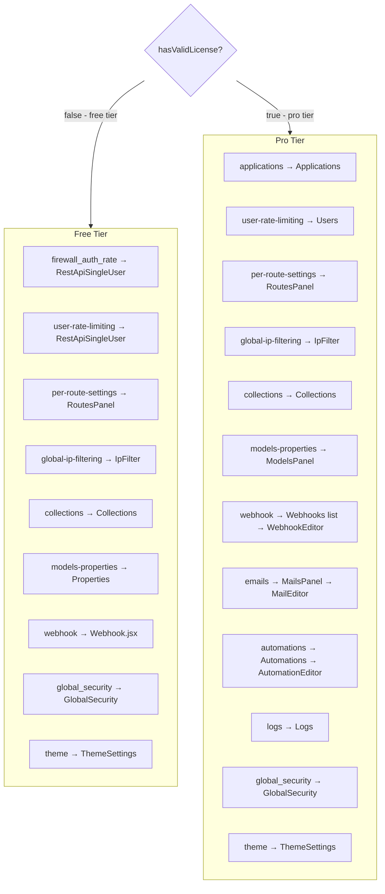
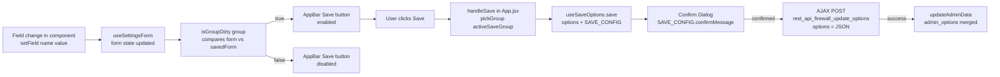
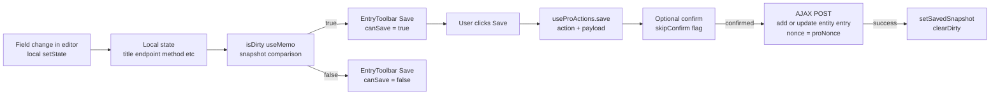

# REST API Firewall – Architecture Map

> Companion to SKILL.md. Purpose: prevent regressions when working across free/pro tiers.
> After any UI change, run the relevant regression checklist at the bottom of this file.

---

## 1 — Panel Registry

Every panel key, which tier sees it, which component renders, and which save routine it uses.

| Panel key | Free component | Pro component | Save routine | PHP group |
|---|---|---|---|---|
| `firewall_auth_rate` | `RestApiSingleUser` | `RestApiSingleUser` | AppBar (free) / AppBar (pro) | `firewall_auth_rate` |
| `user-rate-limiting` | `RestApiSingleUser` | `Users` | AppBar (free) / EntryToolbar (pro) | `firewall_auth_rate` |
| `per-route-settings` | `RoutesPanel` | `RoutesPanel` | AppBar (free) / AppBar (pro) | `firewall_routes_policy` |
| `global-ip-filtering` | `IpFilter` | `IpFilter` | Per-row (IP entries) + **Public Rate Limiting self-contained** | — / `public_rate_limit` |
| `collections` | `Collections` | `Collections` | Inline per-type (free) / Inline per-type (pro, DataGrid→CollectionEditor) | `collections` |
| `models-properties` | `Properties` | `ModelsPanel` | AppBar (free) / EntryToolbar (pro) | `models_properties` |
| `wp-settings` | `WpSettingsPanel` | `WpSettingsPanel` | AppBar (free) / — (pro, self-manages via ModelEditor) | `wp_settings` |
| `webhook` | `Webhook` | `Webhooks` (list) → `WebhookEditor` | AppBar (free) / EntryToolbar (pro) | `webhook` |
| `emails` | — (pro only) | `MailsPanel` → `MailEditor` | — / EntryToolbar | — |
| `automations` | — (pro only) | `Automations` → `AutomationEditor` | — / EntryToolbar | — |
| `logs` | — (pro only) | `Logs` | — | — |
| `applications` | — (pro only) | `Applications` | — | — |
| `global_security` | `GlobalSecurity` | `GlobalSecurity` | AppBar (via `dirtyFlag.save`) | `global_security` |
| `theme` | `ThemeSettings` | `ThemeSettings` | AppBar (both) | `theme` |
| `license` | `License` | `License` | — | — |
| `configuration` | `ConfigurationPanel` | `ConfigurationPanel` | — | — |

**Save routine key:**
- **AppBar** = `showSaveButton` in `PANEL_SAVE_GROUP` (App.jsx) → Navigation AppBar button → `useSaveOptions`
- **AppBar (via `dirtyFlag.save`)** = component exposes its own `save` + `saving` via `setDirtyFlag({ save, saving })` → `App.jsx` detects `dirtyFlag.save` and surfaces the AppBar button — component is NOT in `PANEL_SAVE_GROUP`
- **EntryToolbar** = `useRegisterToolbar` in editor → EntryToolbar replaces AppBar → `useProActions`
- **Inline per-type** = component owns its own inline Save button scoped to the selected type, NOT in `PANEL_SAVE_GROUP` (only Collections)

**Self-contained panels (NOT in `PANEL_SAVE_GROUP`):**

| Component | Panel key | Save mechanism |
|---|---|---|
| `GlobalSecurity.jsx` | `global_security` | Owns form state + `useSaveOptions`; exposes `save`/`saving` via `setDirtyFlag` → AppBar button appears when dirty; cleanup effect clears flag on unmount |
| `Collections.jsx` | `collections` | Save is scoped per collection type; inline Save button, `useSaveOptions` with `skipConfirm: true` |
| `PublicRateLimitSection.jsx` | `global-ip-filtering` (child) | Owns `useSaveOptions` + inline Save button; always rendered inside global IpFilter panel |

---

## 2 — Storage Tiers & The `isGroupDirty` Invariant

### Storage tiers

| Tier | Storage | Write path | PHP handler |
|---|---|---|---|
| **Free** | `wp_options` single row (`rest_api_firewall_options`) | AppBar Save → `rest_api_firewall_update_options` AJAX → `CoreOptions::update_options()` | `CoreOptionsService::ajax_update_options()` |
| **Pro** | Custom DB tables (applications, webhooks, automations, mail templates) | EntryToolbar Save → `add/update_{entity}_entry` AJAX → pro repository classes | Pro plugin AJAX handlers |

> Free-tier options are all in one `wp_options` row. Pro-tier entities live in their own tables. They use completely different save paths — a field wired for one tier will silently fail in the other.

### The `isGroupDirty` invariant

`isGroupDirty(group)` in `useSettingsForm` iterates **only** over keys registered in `CoreOptions::options_config()` under that `group`. When a component calls `setField('someKey', value)`:
- If `someKey` is in `options_config` under the active panel's group → **Save button enables** ✓
- If `someKey` is absent from `options_config` → `form.someKey` is updated but **Save button stays disabled** ✗ (silent no-op)

**Hard rule:** Every UI field that persists data via the AppBar save MUST have a matching entry in `CoreOptions::options_config()` with (a) the **exact same key name** and (b) the **correct `group`**.

### Common regression traps

| Trap | Symptom | Fix |
|---|---|---|
| `setField('jsKey', …)` where `jsKey` ≠ PHP config key | Save button stays disabled after UI change | Match key names exactly |
| `useState` local state instead of `setField` | Changes lost on save/reload; Save button never enables | Replace local state with `setField` calls |
| AJAX load overwrites `form`-derived initial values | Fields reset to defaults on mount, ignoring saved values | Remove AJAX load of fields already in `options_config` |
| New field missing from PHP `options_config` | Silent no-op — field saves nothing | Add key with correct `group` to PHP **first** |

### Checklist before adding any new free-tier field

- [ ] PHP key added to `CoreOptions::options_config()` with correct `group`
- [ ] JS `setField` call uses the **exact same key string** as PHP
- [ ] No parallel AJAX call overwrites `form[key]` on mount
- [ ] Changing the field in the UI enables the AppBar Save button (manual test)

---

## 3 — Panel Routing Diagram



---

## 4 — Save Routine Data Flow

### Free Tier — App.jsx global form state



**Data path:** component `setField` → `useSettingsForm` (App.jsx) → `PANEL_SAVE_GROUP` → `isGroupDirty` → AppBar button → `useSaveOptions` → AJAX → `CoreOptions::update_options()` (PHP)

**PHP option groups** (from `CoreOptions::options_config()`):

| Group | Key count | Notable keys |
|---|---|---|
| `firewall_auth_rate` | 12 | `firewall_auth_method`, `firewall_user_id`, `rate_limit`, `rate_limit_enabled` (authenticated users only) |
| `firewall_routes_policy` | 7 | `enforce_auth`, `enforce_rate_limit`, `firewall_policy` |
| `webhook` | 6 | `application_webhook_endpoint`, `application_webhook_auto_trigger_events`, `application_webhook_type`, `application_host` |
| `theme` | 11 | `theme_redirect_templates_enabled`, `theme_disable_gutenberg` |
| `collections` | 3 | `rest_collection_orders`, `rest_collection_per_page_settings` |
| `models_properties` | 15 | `rest_models_enabled`, `rest_models_embed_*` |
| `global_security` | 10 | `theme_disable_xmlrpc`, `theme_secure_http_headers` |
| `public_rate_limit` | 6 | `public_rate_limit_enabled`, `public_rate_limit`, `public_rate_limit_time`, `public_rate_limit_release`, `public_rate_limit_blacklist`, `public_rate_limit_blacklist_time` |
| `wp_settings` | 1 | `settings_route_acf_options_enabled` |

### Pro Tier — local editor state



**AJAX action naming convention (pro editors):**

| Entity | Add action | Update action | Delete action |
|---|---|---|---|
| Webhook | `add_webhook_entry` | `update_webhook_entry` | `delete_webhook_entry` |
| Automation | `add_automation_entry` | `update_automation_entry` | `delete_automation_entry` |
| Mail template | `add_mail_entry` | `update_mail_entry` | `delete_mail_entry` |

---

## 5 — Nonce & Permissions Architecture

Two separate nonce action strings exist — one per plugin. They are generated, localized, and validated independently.

### Nonce generation (PHP)

| Nonce action | Generated in | Localized global | Tier |
|---|---|---|---|
| `rest_api_firewall_update_options_nonce` | `AdminPage.php` | `window.restApiFirewallAdminData.nonce` | Free |
| `rest_api_firewall_update_pro_options_nonce` | Pro `Bootstrap.php` | `window.restApiFirewallPro.nonce` | Pro |

`window.restApiFirewallPro` is only defined when the pro plugin is active and licensed. In free tier it is `undefined`.

### Nonce resolution (JS)

`LicenseContext.jsx` reads `window.restApiFirewallPro?.nonce` at mount and exports it as `proNonce`.

All AJAX hooks resolve the nonce the same way:

```js
const nonce = proNonce || adminData.nonce;   // proNonce = null in free tier
```

This applies to `useAjax`, `useProActions`, and `useSaveOptions` (fixed — previously `useSaveOptions` hardcoded the free nonce, which would silently fail against any pro-only AJAX handler).

### Handler validation (PHP)

| PHP method | Plugin | Accepts | Capability required |
|---|---|---|---|
| `Permissions::ajax_validate_has_firewall_admin_caps()` | Free | **Both** nonces (tries free first, then pro if active) | `rest_api_firewall_edit_options` |
| `Permissions::validate_ajax_crud_rest_api_firewall_pro_options()` | Pro | **Pro nonce only** (`check_ajax_referer` — wp_die on failure) | `rest_api_firewall_edit_pro_options` |

**Key rule:** Free handlers are forgiving (accept either nonce). Pro handlers are strict. Therefore any call that may reach a pro AJAX action must send the pro nonce — use `proNonce || adminData.nonce`, never hardcode `adminData.nonce` alone.

### Regression trap

If a component sends `adminData.nonce` directly (bypassing the resolution pattern) and the corresponding AJAX action is registered in the pro plugin, the call will hit `wp_die()` silently in pro tier. Always use the three approved hooks (`useAjax`, `useProActions`, `useSaveOptions`) rather than raw `fetch`.

---

## 6 — Rate Limiting Two-Tier Model

Rate limiting is split into two independent tiers, both enforced inside `Firewall::rate_limit()` (hooked at `rest_pre_dispatch`):

| Tier | Traffic | Config source | PHP group | UI panel | Transient prefix |
|---|---|---|---|---|---|
| **Public** | Anonymous (no WP auth) | `wp_options` | `public_rate_limit` | Global IP Filtering (`PublicRateLimitSection`) | `rest_firewall_pub_rl_` |
| **Authenticated** | Logged-in WP users | `wp_options` (free) / custom tables (pro) | `firewall_auth_rate` | Auth & Rate Limiting / Users | `rest_firewall_rl_` |

### PHP lifecycle

1. `Firewall::request()` calls `self::rate_limit($request)` on every REST dispatch.
2. **Auth check:** `wp_get_current_user()->exists()` → selects which rule set to apply.
3. **Anonymous path:** if `public_rate_limit_enabled` is false → early `return true` (no limiting). Otherwise applies `public_rate_limit_*` thresholds; auto-blacklists IP after `public_rate_limit_blacklist` violations.
4. **Authenticated path:** applies existing `rate_limit_*` thresholds from `firewall_auth_rate` group (PolicyRuntime may override per-route).
5. Both paths write to separate transients (different key prefixes) and share the same `IpBlackList::auto_blacklist_ip()` / `RateLimit::*` helpers.

### Key rule

Public and authenticated rate limits are **completely independent**. Changing thresholds in "Auth & Rate Limiting" does not affect anonymous clients, and vice versa. This means:
- Setting `public_rate_limit_enabled = false` disables anonymous rate limiting without touching authenticated user limits.
- A logged-in user is **never** governed by `public_rate_limit_*` — not even if they're in the blacklist from a previous anonymous session (once logged in, the authenticated path applies).

---

## 7 — HTTP Methods 3-Tier Cascade

### Why no public/authenticated split (unlike rate limiting)

Rate limiting splits into two independent pools (public/authenticated) because they are fundamentally different traffic-management concerns — anonymous flood protection vs authenticated service tiers. HTTP method restrictions are **API capability control**: the rule "DELETE is not supported" applies regardless of who is asking. Adding a `public_disabled_methods` pool would duplicate what the per-route policy tree already does with finer granularity.

**For public routes** (e.g., an Events post type that allows anonymous GET): block write methods at the route level — set the route to require authentication for POST/PUT/PATCH/DELETE in the per-route policy tree. The Tier 1 application block also applies to all traffic.

### The 3-tier cascade

| Tier | Scope | PHP key | Where stored | Enforcement |
|---|---|---|---|---|
| 1 — Application block | ALL traffic (anonymous + authenticated) | `disabled_methods` | Application `settings` JSON col | ✅ `PolicyRuntime.php` ~line 78 |
| 2 — Application default | Authenticated users of this app (upper cap) | `default_http_methods` | Application `settings` JSON col | ⚠️ Frontend only (`HttpMethodsSelector allowedMethods` prop) |
| 3 — User allowlist | Specific authenticated user (subset of Tier 2) | `allowed_methods` | `wp_rest_api_firewall_users.allowed_methods` JSON col | ✅ `FirewallPro.php::check_user_constraints()` |

**Cascade rule**: Each tier can only restrict, never expand. A user's `allowed_methods` cannot include a verb absent from `default_http_methods`, and neither can override a Tier 1 block (PolicyRuntime runs before `check_user_constraints`).

**Tier 2 note**: `default_http_methods` enforcement is intentionally frontend-only — the `HttpMethodsSelector allowedMethods` prop grays out verbs not in the app list, preventing invalid saves through the normal UI flow. Server-side re-validation can be added but is not required for the cascade to be correct when data was written through the UI.

---

## 8 — Plugin Routes: Cross-Application Policy

### Background: what currently happens

When Pro applications are configured, `FirewallPro::check()` (priority 1 on `rest_pre_dispatch`) performs credential/IP-based application resolution. If no application matches and at least one enabled application exists, the request is rejected with a JSON `WP_Error 404`. The route namespace is never consulted — plugin routes (`wc/v3`, `acf/v3`, any custom namespace) are blocked exactly like core routes.

`PolicyRuntime::is_wordpress_core_route()` exists in the free plugin but only affects global `enforce_auth` auto-pinning; it has no effect on the Pro application gate.

### Problem

Plugin REST routes belong to the _installation_, not to any single application. Every application shares the same WooCommerce/ACF/custom-plugin routes. Enforcing per-application IP/origin/user rules on them creates friction (a legitimate WC API call blocked because it doesn't carry app credentials) and configuration duplication.

### Decision: Plugin routes bypass per-application enforcement

**Plugin route definition:** first path segment NOT in `['wp', 'oembed', 'batch', 'wp-site-health', 'wp-abilities', 'wp-block-editor']` (inverse of `PolicyRuntime::is_wordpress_core_route()`).

When `ApplicationResolver::resolve()` returns no match (`FirewallPro::check()` no-match branch):
- **Core route** → `WP_Error 404` (unchanged)
- **Plugin route** → skip application enforcement; fall through with global defaults + any per-route policy

Plugin routes still pass through:
- Global IP blacklist (`rest_authentication_errors` — pre-application, unchanged)
- Free-plugin `PolicyRuntime` per-route `disabled` / `protect` / rate-limit settings
- Any per-route access rules configured in the Route Settings Drawer (see below)

### Decision: Route Settings Drawer (replaces Users popover)

A slide-in **Route Settings Drawer** opens when the admin clicks the new "Access settings" button on any route or method node (replacing the old "Set users" text button; gear icon retains its existing custom-mode role).

Three sections:

| Section | Source component |
|---|---|
| Authenticated Users | Logic from `RoutesPolicyUsersPopover`; moved into drawer |
| Allowed IPs | `AllowedIps` (existing component, now usable per-route) |
| Allowed Origins | `AllowedOrigins` (existing component, now usable per-route) |

For **plugin route nodes**, the drawer header shows a persistent `Alert`:  
> "These settings apply to all applications on this installation."

### Decision: Plugin route settings are global (synced across applications)

Plugin route settings (IPs, origins, users) are stored in a dedicated wp_options key `rest_firewall_plugin_routes_policy`, not inside any per-application policy.

Route UUIDs remain stable (`md5(route + '|' + method)`) so settings survive application changes. When the tree loads for any application, plugin-namespace nodes merge in the global plugin policy.

Saving from the drawer: if `isPluginRoute(node)` → write to `rest_firewall_plugin_routes_policy`; otherwise write to the per-application policy (existing behaviour).

### Decision: Warning dialog on first plugin route edit

First time the drawer is modified for a plugin route, a one-time confirmation dialog appears:

> **"This change applies across all applications"**  
> Plugin route settings are shared across all your applications.  
> [Don't show again] [Cancel] [I understand]

"Don't show again" sets `localStorage['raf_plugin_route_warning_dismissed']`. The `disable` toggle on a plugin route triggers the same warning.

### Route type summary

| Route type | Application enforcement | Route Settings Drawer | Storage |
|---|---|---|---|
| Core (`wp/v2`, `oembed`, `batch`, `wp-site-health`, `wp-abilities`, `wp-block-editor`) | Full per-application (IP, origin, users) | ✅ | Per-application `firewall_policy` |
| Plugin (`wc/v3`, `acf/*`, custom) | **Bypassed** | ✅ | Global `rest_firewall_plugin_routes_policy` |

### Key JS helper

`isPluginRoute(node)` in `routesPolicyUtils.js`:
```js
const CORE_NAMESPACES = new Set(['wp', 'oembed', 'batch', 'wp-site-health', 'wp-abilities', 'wp-block-editor']);
export function isPluginRoute(node) {
    const first = (node.path || '').replace(/^\//, '').split('/')[0];
    return !!first && !CORE_NAMESPACES.has(first);
}
```

---

## 9 — WordPress Applications Only Mode

### Problem

An admin running WordPress as a headless API backend must configure these settings independently today:
- Template redirect → Theme panel (requires theme deployment)
- XML-RPC block → Security panel
- Non-matching REST request handling → not implemented at all (currently always JSON 404)
- Rate limiting → REST-only (not frontend/xmlrpc traffic)

There is no cohesive "API-only mode."

### Decision: Single "Applications Only" toggle in the Security panel

A new **Applications Only** toggle (group `global_security`, key `applications_only_mode`, boolean `false`) appears in `GlobalSecurity.jsx`. When enabled:

1. `theme_redirect_templates_enabled = true` — redirect WordPress templates to configured destination
2. `theme_disable_xmlrpc = true` — block XML-RPC endpoint
3. `applications_only_mode = true` — (Pro) unmatched core REST requests → HTTP redirect, not 404

Free tier: steps 1 + 2 activate (template redirect + xmlrpc block already work without a license).  
Pro tier: step 3 additionally makes `FirewallPro.php` redirect unmatched core REST requests.

### Decision: Redirect settings move from Theme panel to Security panel

`theme_redirect_templates_*` options remain in `CoreOptions` (backwards-compatible) but the UI section **"Redirect"** moves from `ThemeSettings.jsx` into `GlobalSecurity.jsx`. The Applications Only toggle sits above the redirect destination fields.

Theme panel retains: Deploy Theme, ACF sync, Content (Gutenberg / p-tags / emoji), Images.  
Security panel gains: Redirect section + Applications Only toggle.

### Decision: Shared redirect destination

Template redirect and non-matching REST redirect read the same destination fields (`theme_redirect_templates_preset_url` / `theme_redirect_templates_free_url`). No new option fields required.

### Decision: Non-matching REST request behaviour

| `applications_only_mode` | Route type | Outcome |
|---|---|---|
| `false` | Any | JSON `WP_Error 404` (unchanged) |
| `true` (Pro) | Core route, no app match | `wp_redirect()` to configured destination → `exit` |
| `true` (Pro) | Plugin route, no app match | Falls through per §8 (never redirected) |

Implementation: inside `FirewallPro::check()` no-match branch, after `find_all_enabled()` confirms apps exist — check `applications_only_mode` + `is_wordpress_core_route()` + read redirect URL → `wp_redirect() + exit`. Plugin routes skip to return from the entire function.

### Decision: Rate limiting scope stays REST-only

Expanding rate limiting to all WordPress traffic (firing on `init`) requires significant PHP refactoring and may affect frontend visitors. Deferred. Document as a future expansion point.

### New CoreOptions entry

```php
'applications_only_mode' => [
    'default_value'     => false,
    'sanitize_callback' => 'rest_sanitize_boolean',
    'group'             => 'global_security',
    'context'           => [ 'free', 'pro' ],
],
```

---

## 10 — Regression Checklists

Run the relevant checklist after any change. Check each item before calling done.

---

### ✏️ After modifying a free-tier panel UI

- [ ] Component signature is `{ form, setField }` — no `onSave`, `saving`, `formDirty` props
- [ ] No `<Toolbar>` or `<Button variant="contained">Save` rendered inside the component
- [ ] Panel key is in `PANEL_SAVE_GROUP` in `App.jsx` (mapped to correct PHP group) — exception: self-contained panels (`GlobalSecurity`, `Collections`, `IpFilter`/`PublicRateLimitSection`) are intentionally absent
- [ ] `Navigation.jsx` save button condition is `showSaveButton` (no `&& hasValidLicense`)
- [ ] Every `setField(key, …)` call uses the **exact PHP `options_config` key name** (see §2 invariant)
- [ ] No local `useState` used for fields that must be persisted — use `form.*` + `setField` instead
- [ ] Changing a field makes the AppBar Save button enabled; reverting disables it
- [ ] Save triggers a confirm dialog with the message from `SAVE_CONFIG` in `App.jsx`

---

### ✏️ After modifying a pro entry editor (Webhook/Automation/Mail)

- [ ] Editor calls `useRegisterToolbar` with `handleSave` and `handleDelete` refs
- [ ] `updateToolbar({ canSave: isDirty })` called in `useEffect` watching all dirty fields
- [ ] `isDirty` is a `useMemo` comparing current state to `savedSnapshot` (not `useState`)
- [ ] New entry (isNew=true): `save()` called with `skipConfirm: true`, navigates back on success
- [ ] Existing entry update: `setSavedSnapshot` called in `onSuccess` to clear dirty state
- [ ] Delete: `remove()` called with confirm title/message, `clearDirty()` + `onBack()` in `onSuccess`

---

### ✏️ After modifying Navigation.jsx

- [ ] Save button condition remains `{ showSaveButton && (` — no license gate
- [ ] `showSaveButton` is still derived from `PANEL_SAVE_GROUP[panel] !== null` in App.jsx
- [ ] Module toggle (enable/disable) still calls `useProActions.save` with confirm dialog
- [ ] Breadcrumb lookup still uses the fallback pattern (visible items first, then all items)

---

### ✏️ After adding or removing a settings option

- [ ] Option key added to `CoreOptions::options_config()` in PHP with correct `group` field
- [ ] `group` matches one of the keys in `PANEL_SAVE_GROUP` (otherwise AppBar save won't include it)
- [ ] `options_config_for_js()` strips `sanitize_callback` before exposing to `adminData`
- [ ] On the JS side, `form.key_name` and `setField('key_name', value)` work automatically (no extra wiring needed via `useSettingsForm`)
- [ ] Default value set in PHP `default_value` so first paint shows correct initial state
- [ ] No parallel AJAX `useEffect` overwrites `form[key]` on mount (see §2 regression trap #3)

---

### ✏️ After changing free/pro tier gating on a feature

- [ ] If a panel is now free-only: added to `PANEL_SAVE_GROUP` unconditionally, AND deleted inside the `if (hasValidLicense)` block
- [ ] If a panel is now pro-only: removed from `PANEL_SAVE_GROUP`, component gated with `hasValidLicense &&` in App.jsx
- [ ] Navigation `menuItems`: `hidden` field updated to match new tier
- [ ] Section C of SKILL.md updated if it was a webhook event context change

---

### ✏️ After changing webhook events (PHP)

- [ ] Event added/modified in `WebhookAutoTrigger::get_available_events()`
- [ ] `context` array is `['free', 'pro']` for free-available or `['pro']` for pro-only
- [ ] Free-tier event table in SKILL.md Section C updated to match
- [ ] `virtual: true` set only for programmatically-dispatched events (e.g. `inbound_webhook`) — these skip real WP hook registration
- [ ] `accepted_args` matches the actual WP hook signature

---

### ✏️ After adding a new CRUD entity (pro)

- [ ] PHP controller registered in `Bootstrap.php`
- [ ] AJAX action names follow convention: `add_{entity}_entry`, `update_{entity}_entry`, `delete_{entity}_entry`
- [ ] Editor component uses `useRegisterToolbar` + `useProActions` (not inline buttons)
- [ ] List component (e.g. `Webhooks.jsx`) uses `useNavigation` subKey for open/new routing
- [ ] Panel key added to `Navigation.jsx` menuItems with `hidden: true` (pro app-scoped) and/or visible free-tier entry
- [ ] Panel registry table in this file updated

---

## 11 — Key File Reference

| File | Role |
|---|---|
| `src/App.jsx` | Panel routing, `PANEL_SAVE_GROUP`, `handleSave`, `SAVE_CONFIG` |
| `src/hooks/useSettingsForm.js` | Free-tier form state: `form`, `setField`, `isGroupDirty`, `pickGroup` |
| `src/hooks/useSaveOptions.js` | Free-tier AJAX save + confirm dialog |
| `src/hooks/useProActions.js` | Pro-tier save/delete + confirm dialog |
| `src/hooks/useRegisterToolbar.js` | Pro-tier EntryToolbar registration |
| `src/components/Navigation.jsx` | AppBar save button (`showSaveButton` — no license gate) |
| `src/contexts/EntryToolbarContext.jsx` | EntryToolbar state |
| `src/contexts/LicenseContext.jsx` | `hasValidLicense`, `proNonce` |
| `src/contexts/AdminDataContext.jsx` | `adminData`, `updateAdminData` |
| `inc/Core/CoreOptions.php` | All option definitions, groups, defaults, sanitizers |
| `inc/Webhook/WebhookAutoTrigger.php` | Event catalogue, free/pro context, hook registration |
| `inc/Core/Bootstrap.php` | PHP entry point, JS object assembly |
| `inc/Policy/PolicyRuntime.php` | Route policy resolution, `is_wordpress_core_route()` classifier |
| `/rest-api-firewall-pro/inc/Firewall/FirewallPro.php` | Pro application enforcement, no-match branch, plugin route bypass |
| `/rest-api-firewall-pro/inc/Application/ApplicationResolver.php` | Credential/IP-based application resolution |
| `src/components/Firewall/Routes/RouteSettingsDrawer.jsx` | Per-route access settings (users + IPs + origins); plugin route warning |
| `src/components/Firewall/Routes/routesPolicyUtils.js` | `isPluginRoute()` helper, tree normalisation |
