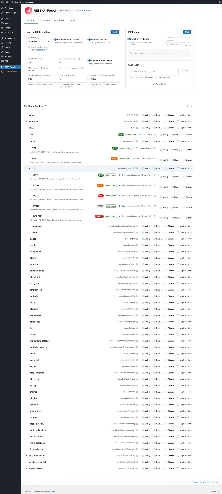
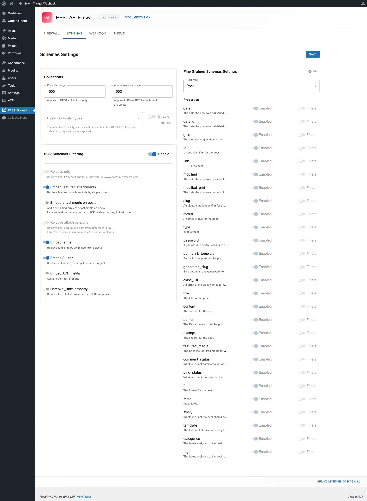
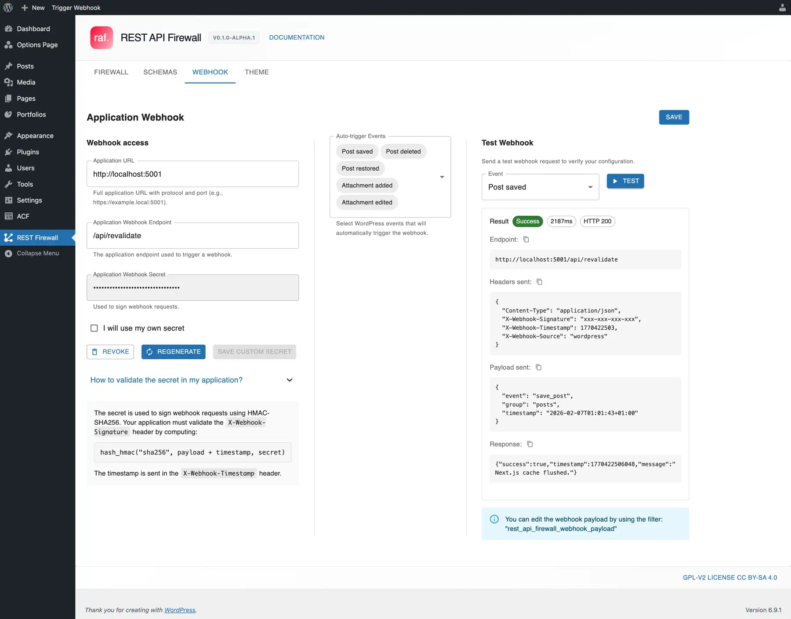
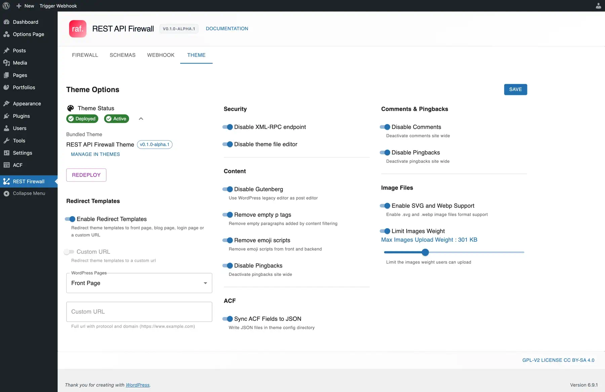

# WordPress REST API Firewall

A WordPress plugin focused exclusively on REST API security and filtering.

REST API Firewall acts as a secure layer for the WordPress REST API by enforcing application password authentication and rate limiting on all routes. Rate-limited IPs are automatically blacklisted.

It integrates seamlessly with external applications built with Next.js, React, Vue, or any framework capable of consuming a REST API. Configure webhooks to notify your application of content changes.

> **Alpha Version**: This plugin is currently under extensive testing and significant changes may still occur in the code architecture. It is made public to gather feedback and contributions. You are free to test it, but we cannot guarantee its stability and cannot be held responsible for any data loss.

## Screenshots

<table>
  <tr>
    <td align="center" width="50%">
      
      <br /><strong>Firewall</strong><br />
      <sub>Authentication, rate limiting, IP filtering</sub>
    </td>
    <td align="center" width="50%">
      
      <br /><strong>Schemas</strong><br />
      <sub>Response filtering and data embedding</sub>
    </td>
  </tr>
  <tr>
    <td align="center" width="50%">
      
      <br /><strong>Webhook</strong><br />
      <sub>Notify external apps on content changes</sub>
    </td>
    <td align="center" width="50%">
      
      <br /><strong>Theme</strong><br />
      <sub>Headless theme deployment and options</sub>
    </td>
  </tr>
</table>

## Requirements

- WordPress 6.0+
- PHP 7.4+

## Installation

### 1. Download or clone this repository into your `wp-content/plugins/` directory:
```bash
cd wp-content/plugins/
git clone https://github.com/AfterglowWeb/wordpress-rest-api-firewall.git rest-api-firewall
```
### 2. Install the dependencies and build

Navigate to `wp-content/plugins/rest-api-firewall` directory:

```bash
cd wp-content/plugins/rest-api-firewall
```

Install the PHP dependencies and build:

```bash
composer install
composer build
```

Install the Javascript dependencies and build:

```bash
npm install
npm run build
```
or
```bash
yarn
yarn build
```

### 3. Activate the plugin through the WordPress admin

### 4. Optional, install the headless theme  bundled with the plugin. 
Navigate to the `Theme Options` tab in the **REST API Firewall** admin page and hit the Deploy button.

## Free Features

- **Global Authentication** - Enforce WordPress application password authentication on all REST routes
- **Disable users endpoints** - Hide your users details
- **Global Rate Limiting** - Protect against abuse with configurable request limits
- **Auto-Blacklist IPs** - Automatically block IPs that exceed rate limits *(under development)*
- **Routes Explorer** - Visualize all REST API routes and understand what WordPress each plugin exposes
- **Headless Theme** - Deploy a theme to disable frontend rendering entirely with additional options:
  - Redirect all templates to a page or custom URL
  - Disable Gutenberg site-wide
  - Disable comments site-wide
  - Enable WebP and SVG support
  - Limit upload file sizes

## REST API Firewall Pro

### Security & Access Control
- **IP Filtering** - Whitelist and blacklist with CIDR support
- **Domain Stripping** - Remove all WordPress domain references from API output
- **Uploads Dir Stripping** - Make your media relative. Remove upload dir part from media urls
- **Geo IP Blocking** - Automatically block or allow requests by country *(under development)*
- **Per-Route Control** - Fine-grained authentication, rate limiting, and disabling per endpoint
- **Cascade Rules** - Apply settings to child routes automatically
- **Post Type Control** - Expose only selected post types via REST API

### Multi-Site & Multi-App
- **Multiple Applications** - Manage separate API users and webhooks for different frontends *(under development)*
- **WordPress Multisite** - Native support for network installations
- **Team Dashboards** - Separate admin interfaces for large teams *(under development)*

### Monitoring *(under development)*
- **Activity Logs** - Monitor and export network activity
- **Server Metrics** - Track capacity and performance
- **Notifications** - Alerts via email and webhooks

### Advanced Options *(under development)*
- **Field Mapping** - Remap post fields to custom keys for cleaner API responses
- **Domain Stripping** - Remove all WordPress domain references from API output

## Roadmap Free Features

| Version | Milestone |
|---------|-----------|
| 1.0.0 | Stable release |
| 0.1.0-beta.1 | Documentation |
| 0.1.0-alpha.3 | Linting and testing (PHPUnit, Jest) |
| 0.1.0-alpha.2 | Progressive migration from JavaScript to TypeScript |

### Upcoming in 0.1.0-alpha.1
- UI: Wording and layout improvements
- Auto-blacklist IPs on rate limit
- Automation on Webhook
- UI: Schemas filtering result preview, submit buttons rationalization

## Changelog

### 0.1.0-alpha.1
- Initial release
- Fork from Blank, Wordpress Headless Theme repo: 
- Major refactoring to plugin architecture

## Contributing

Contributions are welcome! Please open an issue or submit a pull request.

## License

GPL-2.0-or-later

## Credits

This project originated as a fork of a headless WordPress theme commissioned by a PR firm. It underwent major refactoring to adopt a plugin architecture, though the theme functionality has been preserved as a bundled extension.
