# WordPress Application Layer

A WordPress plugin that provides a secure application layer for the WordPress REST API.

WordPress Application Layer is a comprehensive suite designed to secure, filter, and extend the WordPress REST API while enabling seamless communication with front-end applications. It integrates with any technology or service capable of consuming REST APIs and webhooks.

- Create multiple applications with distinct policy rules and data views, scoped per route and per user.
- Map collections and properties through JSON objects, similar to Firebase or Supabase.
- Create application users with restricted roles and specific authentication methods (JWT, OAuth, SSO, and WordPress Application Password).
- Trigger webhooks on WordPress events and custom events *(support for major plugin events is under development)*.
- Send notification emails.
- Spin up a blank front-end template.

> **Alpha version** 
> This plugin is under active development. Architectural changes may still occur.
> It is publicly available for testing and feedback. Stability is not yet guaranteed.

## Screenshots

<table>
  <tr>
    <td align="center" width="50%">
      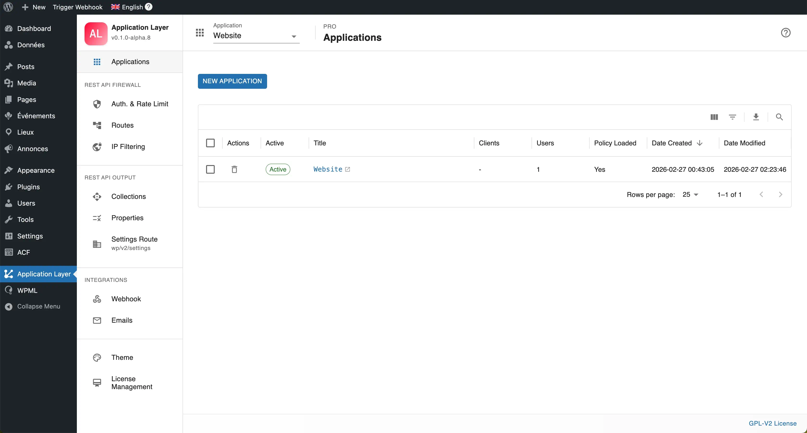
      <br /><strong>Applications List Tab</strong><br />
    </td>
    <td align="center" width="50%">
      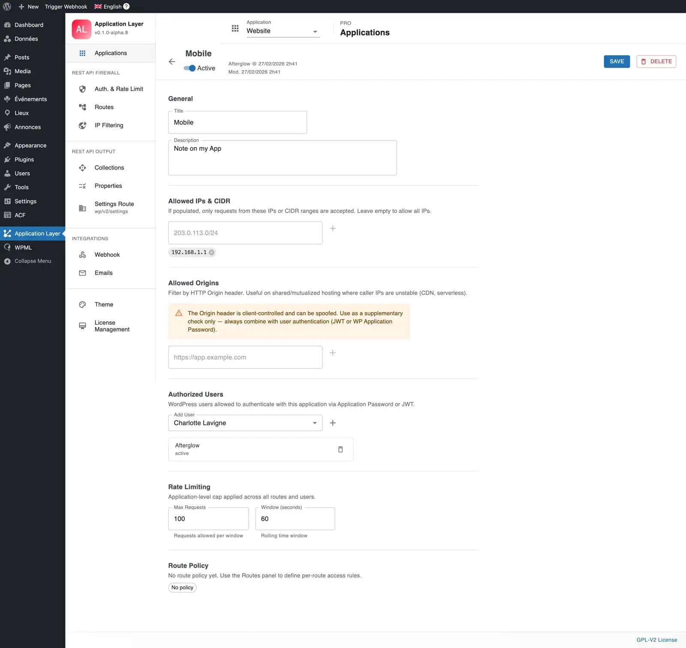
      <br /><strong>New Application Panel</strong><br />
    </td>
  </tr>
  <tr>
    <td align="center" width="50%">
      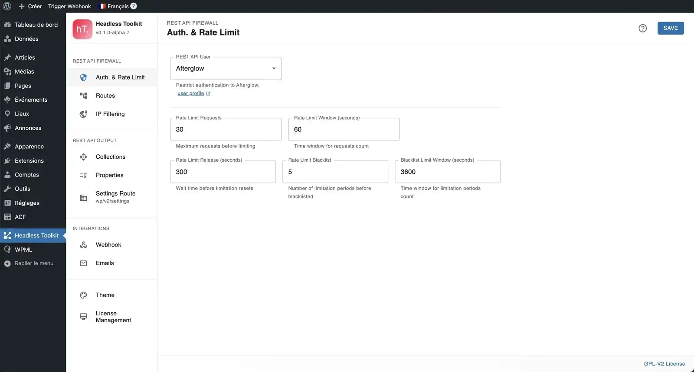
      <br /><strong>Auth. and Rate Limit. Tab (free version)</strong><br />
    </td>
    <td align="center" width="50%">
      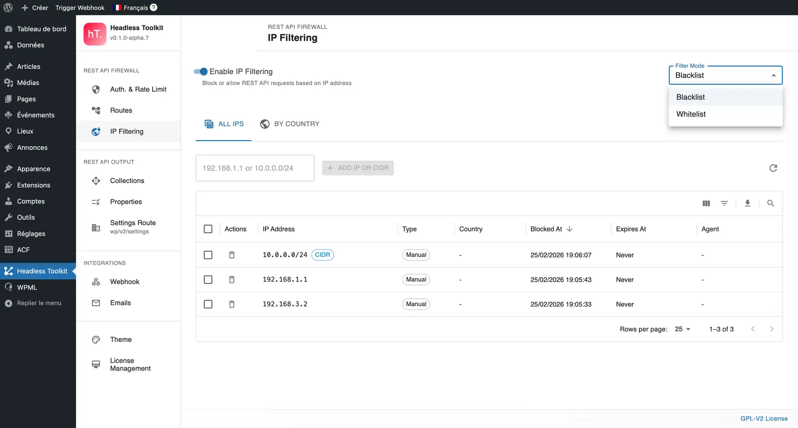
      <br /><strong>IPs Filter Tab</strong><br />
    </td>
    
  </tr>
  <tr>
    <td align="center" width="50%">
      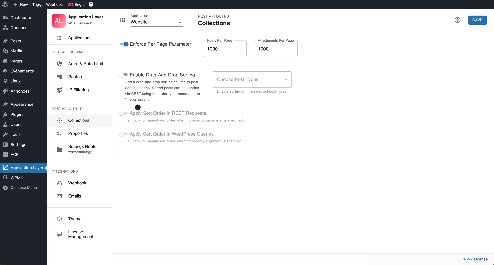
      <br /><strong>Collections Tab</strong><br />
    </td>
    <td align="center" width="50%">
      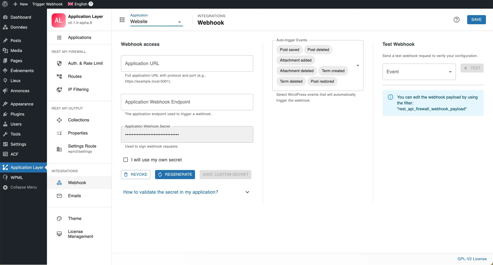
      <br /><strong>Webhook Tab (free version)</strong><br />
    </td>
  </tr>
  <tr>
    <td align="center" width="50%">
      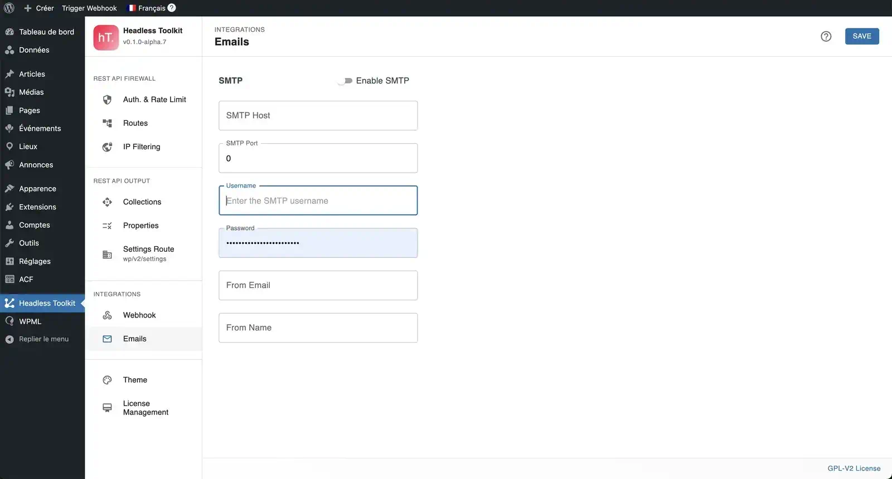
      <br /><strong>Emails Tab *(under development)*</strong><br />
    </td>
    <td align="center" width="50%">
      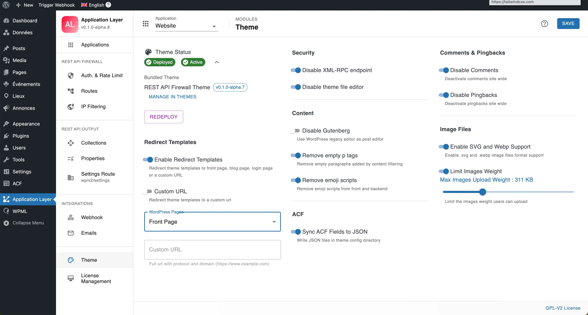
      <br /><strong>Theme Tab</strong><br />
    </td>
  </tr>
  <tr>
    <td align="center" width="50%" height="300px">
      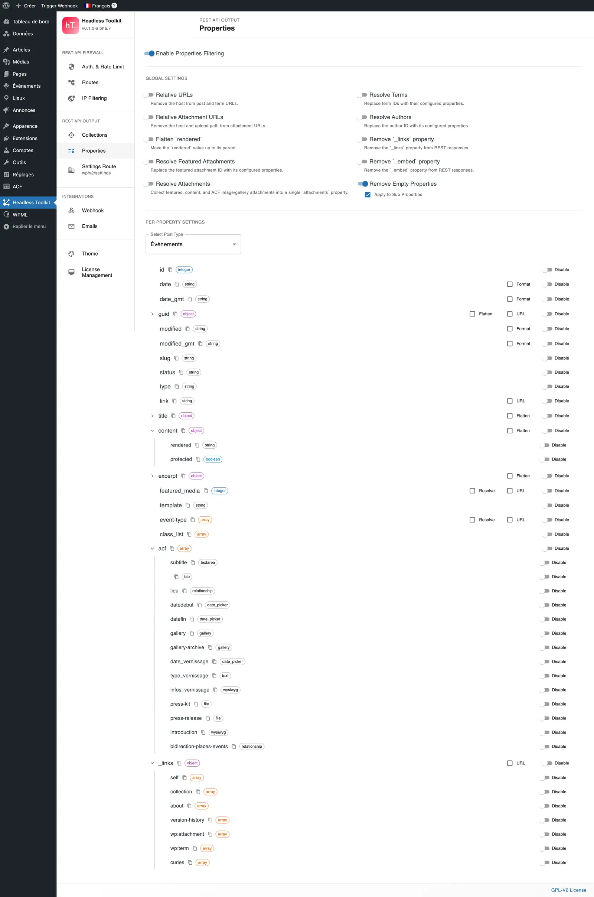
      <br /><strong>Properties Tab (free version)</strong><br />
    </td>
    <td align="center" width="50%" height="300px">
      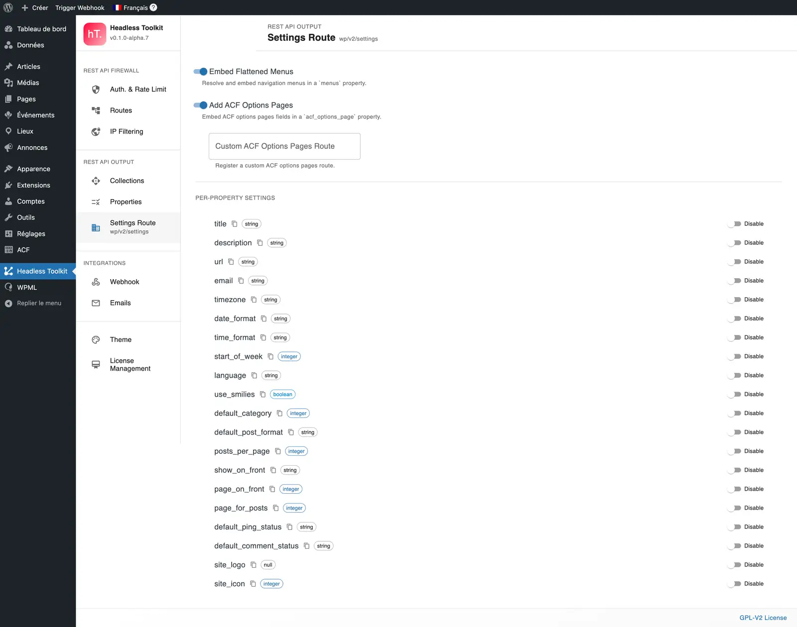
      <br /><strong>Settings Route Tab (free version)</strong><br />
    </td>
  </tr>
  <tr>
    <td align="center" width="50%" height="500px">
      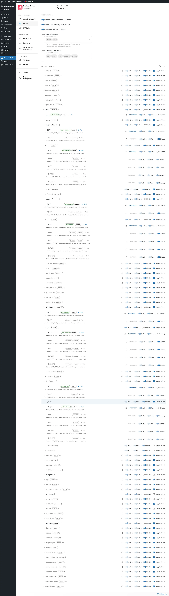
      <br /><strong>Routes Tab (free version)</strong><br />
    </td>
    <td align="top" width="50%">
      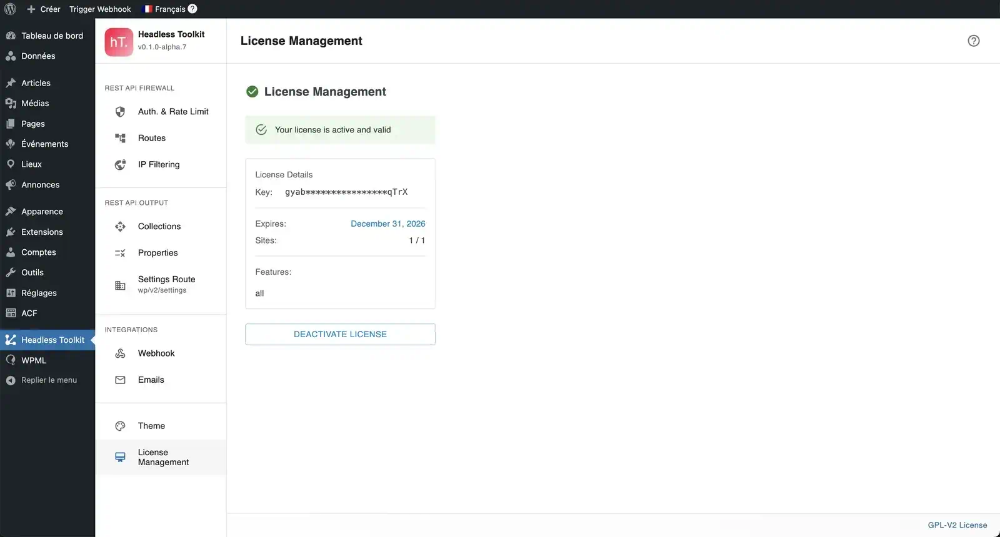
      <br /><strong>License Tab</strong><br />
    </td>
  </tr>

</table>

## Wordpress Application Layer — FREE

- Enforce authentication, rate limiting, and IP blacklisting.
- Add ACF options pages to the wp/v2/settings route.
- Explore REST API routes and schemas to understand how and where data is exposed.
- Trigger webhooks to your front-end application on WordPress events.
- Configure an SMTP server.
- Send email notifications on REST API security and traffic events. *(Under development)*
- Configure plugin bypass rules. (Under development)
- Compatible with WordPress multisite installations.

> Each admin option exposes a WordPress filter for advanced customization.

### Headless Mode

<details>
<summary>Full features list</summary>

Running fully headless? Deploy the bundled blank theme for additional control:
- Redirect all front-end templates
- Disable comments
- Disable pingbacks
- Disable XML-RPC
- Disable the theme editor
- Limit image file size, and more
</details>

## Wordpress Application Layer — PRO

Wordpress Application Layer PRO introduces a multi-application architecture: serve multiple front-end applications with distinct REST API data views from a single WordPress installation. Configure multiple application environments and run them simultaneously.
- Each application has its own security and content policy.
- Each application has one or multiple users.
- Each user has its own Rate Limit, Auth Methods (JWT, oAuth, SSO or Wordpress Application Password), HTTP Methods (GET, POST, PUT, PATCH, DELETE) and Routes
- Authentication(s) and/or IP(s) determine which application configuration is loaded.
- The same data source can be exposed through multiple REST API “views.”
- Each application can replace the default wp/v2 namespace with a custom namespace (under development).

You may also configure a single application and benefit from all Pro features.

Additionally, you can run applications entirely through webhooks. Data is sent using the same schema as the REST API.

### Pro Per Application Features

<details>
<summary>Full features list</summary>

### Settings

- Name your application and define: allowed IPs/CIDR, global application Rate Limit, users and more.
- Export and import application configurations.

### Security

- Create multiple REST API users.
- Assign authentication methods: JWT, OAuth, SSO or WordPress Application Password.
- Define allowed HTTP methods per user (GET, POST, PUT, PATCH, DELETE).
- Add HTTP headers for security, caching, or compression (under development).
- Enforce per-route and per-method policies:
    - Restrict access to specific users
    - Rate-limit routes
    - Modify HTTP headers
    - Disable methods
    - Disable entire routes
    - Disable routes by post type or taxonomy.
    - Disable routes by HTTP method.
- Enable whitelist mode or advanced blacklist mode with:
    - Country blocking
    - CIDR blocking
    - IP/CIDR import & export

### REST API Output

- Selectively disable or filter properties per post type and taxonomy.
- Resolve, flatten or filter: rendered, attachments, terms, author, date, and meta fields.
- Rename properties dynamically.
- Hide _embed and _links properties.
- Create a custom endpoint for ACF options page data.
- Remove the WordPress domain from URLs.
- Remove the uploads directory from attachment URLs.
- Additionally, replace the REST API response by using our json builder to map properties through JSON objects, similar to Firebase or Supabase *(under development)*

### Webhooks
- Create multiple secured webhooks.
- Trigger webhooks on:
    - WordPress core events
    - Supported plugin events
    - Custom plugin events
    - Custom CRON events
    - REST API events
- Send email notifications for webhook executions.

### Emails

- Create multiple notification email templates.

#### Monitoring *(under development)*

- Monitor and export network and user activity.

</details>

## How does it work?

Wordpress Application Layer operates exclusively within REST API read and embedded contexts. Admin loggedin queries are forwarded untouched so it does not interfere with core WordPress or plugin functionality in the admin interface.

If certain plugins require public REST API access, you can configure bypass rules.

## Extra Modules

<details>
<summary>Headless Forms — Endpoints & Entry Management</summary>

### Headless Forms — Endpoints & Entry Management

Create secure endpoints to submit form data using Wordpress Application Layer’ security framework.

The Entries Manager provides full CRUD operations for form submissions and is compatible with WPForms and Contact Form 7 out of the box.

Focused on security and privacy, it includes:
- Configurable data retention periods
- Advanced GDPR options
- AES-256 entry encryption
- Webhooks and notifications

This module can be installed independently from Wordpress Application Layer.
</details>

<details>
<summary>(Planned) WooCommerce Headless Applications</summary>

### (Planned) WooCommerce Headless Applications

A bridge module providing headless access to Woocommerce.
Its role is to:
- Validate application
- Validate auth
- Resolve cart token
- Forward to Woo route
- Filter response
- Return

#### Supported Features (MVP Scope)

- Products (read-only, via existing routes)
- Cart operations
- Checkout
- Stripe payments
- PayPal payments
- Logged-in and guest users
- Shipping rate retrieval

#### Not Supported

- Subscriptions
- Complex coupon logic
- Multi-currency
- Payment gateways other than Stripe and PayPal
- Blocks-specific checkout flows
</details>

## Requirements

- WordPress 6.0+
- PHP 7.4+

## Installation

### 1. Download or clone this repository into your `wp-content/plugins/` directory

```bash
cd wp-content/plugins/
git clone https://github.com/AfterglowWeb/wordpress-rest-api-firewall.git rest-api-firewall
```

### 2. Install the dependencies and build

Navigate to the `wp-content/plugins/rest-api-firewall` directory:

```bash
cd wp-content/plugins/rest-api-firewall
```

Install the PHP dependencies and build:

```bash
composer install
composer build
```

Install the JavaScript dependencies and build:

```bash
npm install
npm run build
```

or

```bash
yarn
yarn build
```

### 3. Activate the plugin through the WordPress admin

### 4. Optional: install the headless theme bundled with the plugin

Navigate to the **Wordpress Application Layer** admin page, open the `Theme Options` tab, and click **Deploy**.

## Roadmap — Free Features

Current; 0.1.0-alpha.17

| Version | Milestone |
|---------|-----------|
| 1.0.0 | Stable release |
| 0.1.0-beta.1x | Documentation |
| 0.1.0-alpha.3x | Linting and testing (PHPUnit, Jest) |
| 0.1.0-alpha.2x | Migration from JavaScript to TypeScript |

### Upcoming in 0.1.0-alpha.18
- Email notification editor

## Changelog

### 0.1.0-alpha.17
- UI: layout refactorization
- Single source of truth for options
- Free / Pro procedure articulation
- Auto‑blacklist IPs on rate limit
- IPs table management
- Webhook automation on WordPress Events

### 0.1.0-alpha.1

- Initial release
- Fork from the Blank WordPress Headless Theme repo
- Major refactoring to a plugin architecture

## Contributing

Contributions are welcome! Please open an issue or submit a pull request.

## License

GPL-2.0-or-later

## Credits

This project originated as a fork of a headless WordPress theme commissioned by a PR firm. It underwent major refactoring to adopt a plugin architecture, though the theme functionality has been preserved as a bundled extension.
