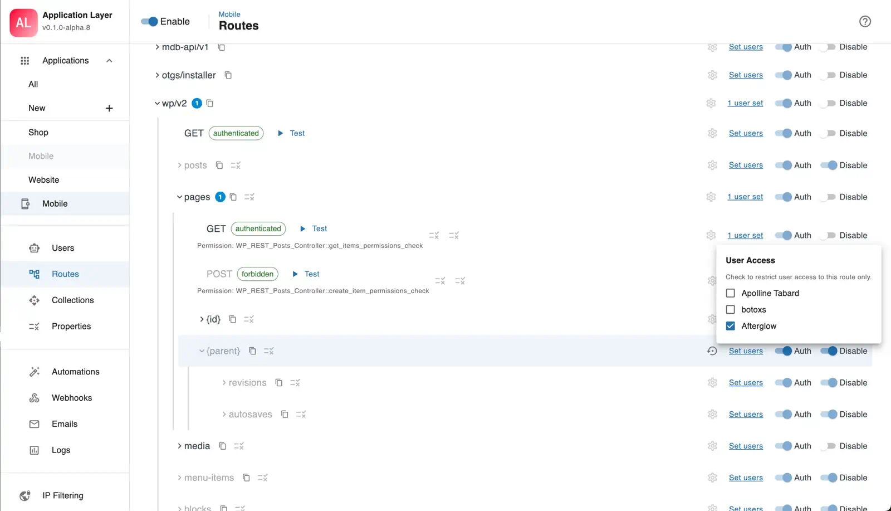

# WordPress Application Layer



📖 **[Documentation](https://wal.abc-plugins.com)**

WordPress Application Layer sits between WordPress and your client applications.

It lets you control what data is exposed, who can access it, how it is shaped, and at what rate, while also hardening key WordPress surfaces such as login and IP access.

Beyond REST API responses, it can also **drive your front-end through webhooks**. WordPress events (post publish, user register, WooCommerce order, custom CRON...) can push data to your application in real time using the same schema as the REST API.

You can combine both approaches, or rely on webhooks only.

Designed for **headless WordPress** architectures, **multi-application** setups, **event-driven** delivery, and sites that need **security hardening across both REST API and WordPress surfaces**.

> **Alpha version**
> This plugin is under active development. Most documented features are implemented and functional — some are still being finalized. Architectural changes may still occur.
> It is publicly available for testing and feedback. Stability is not yet guaranteed.

## Free Features

| Feature | Description |
|---|---|
| **Authentication** | WordPress Application Password (hardened to a single authorized user) and JWT |
| **Rate Limiting** | Request quotas for authenticated traffic and public traffic with independent settings |
| **Auth Hardening** | Login protection controls (attempt limits, block window, escalation) |
| **IP Filtering** | Global blocklist with manual and automatic blocking, plus read-only GeoIP visibility |
| **Routes** | Enforce auth and rate limiting globally. Disable default user routes to reduce enumeration exposure |
| **Properties & Models** | Apply sitewide response transforms: resolve attachments, terms & authors, flatten rendered fields, remove domain from URLs. Rules apply globally across all routes — individual property control requires Pro |
| **WordPress Security** | Harden key WordPress surfaces: XML-RPC, comments, pingbacks, feeds, file protections, security headers |
| **Webhook** | Single outbound webhook with event triggers |
| **Hooks API** | Every option exposes a WordPress filter for customisation |

## Pro Features

| Feature | Description |
|---|---|
| **Applications** | Isolate all settings per client — auth, routes, data, webhooks |
| **IP Filtering** | Both whitelist and blacklist modes. Whitelist restricts access to allowed origins only. Blacklist with configurable retention. CIDR range support. Block or allow by country (GeoIP) |
| **WordPress Mode** | Applications-only mode, trusted IPs, and emergency reset token for headless lockout recovery |
| **Collections** | Enforce per-page limits and drag-and-drop sort order |
| **Routes Policy** | Per-route method control, user assignment, rate limiting, redirections, and access settings drawer |
| **Properties & Models** | Disable, rename or remap any individual property. Remove empty properties. Build fully custom JSON schemas |
| **Automations** | Event-driven workflows with conditions and chained actions |
| **Multiple Webhooks** | Unlimited outbound webhooks, scoped per application |
| **Email Templates** | Transactional email templates with SMTP configuration, per application |
| **Settings Route** | Schema editor for `/wp/v2/settings` — ACF options pages and resolved WordPress menus |
| **Logs** | Full request history and audit trail |

## Free vs Pro

| Feature | Free | Pro |
|---|:---:|:---:|
| REST API route explorer | ✅ | ✅ |
| Authentication & Rate Limiting | ✅ | ✅ |
| Auth Hardening (login protection) | ✅ | ✅ |
| Properties & Models (sitewide transforms) | ✅ | ✅ |
| Routes: global method / post-type / taxonomy disable | ✅ | ✅ |
| WordPress Security Hardening | ✅ | ✅ |
| Webhook (single, post lifecycle events) | ✅ | ✅ |
| Hooks & Filters API | ✅ | ✅ |
| IP Filtering (blacklist) | ✅ | ✅ |
| Multiple Applications | — | ✅ |
| IP Filtering whitelist + CIDR + country blocking | — | ✅ |
| WordPress Mode (applications only, trusted IPs, emergency reset) | — | ✅ |
| Collections & Sort Order | — | ✅ |
| Properties & Models (per-property control + custom schemas) | — | ✅ |
| Settings Route schema editor (ACF options, menus) | — | ✅ |
| Per-Route Policy (per-route disable, redirect, user restriction) | — | ✅ |
| Automations | — | ✅ |
| Multiple Webhooks (unlimited, per application) | — | ✅ |
| Email Templates | — | ✅ |
| Request Logs & Audit Trail | — | ✅ |

## See How It Works

WordPress Application Layer centers on REST API policy and response control, and also includes WordPress-wide protections such as global IP filtering and login hardening. Admin-authenticated requests are forwarded untouched where relevant, so normal WordPress administration workflows remain intact.

**REST API request pipeline:**

```
Incoming REST request
       │
       ▼
┌─────────────────────────┐
│  Application Matching   │  ← Which application owns this request? (Pro)
└────────────┬────────────┘
             │
┌────────────▼────────────┐
│  Authentication Check   │  ← JWT / WP App Passwords (OAuth: Pro)
└────────────┬────────────┘
             │
┌────────────▼────────────┐
│    IP / Rate Limiting   │  ← Per-user or global quotas, GeoIP blocking (Pro)
└────────────┬────────────┘
             │
┌────────────▼────────────┐
│    Routes Policy        │  ← Allowed methods, route-level rules (Pro)
└────────────┬────────────┘
             │
┌────────────▼────────────┐
│  WordPress REST API     │  ← Native WP handler
└────────────┬────────────┘
             │
┌────────────▼────────────┐
│  Property Transforms    │  ← Models: rename, remove, resolve, remap fields
└────────────┬────────────┘
             │
       REST Response
```

Alongside this pipeline, webhooks and email notifications run independently. Any WordPress event (post transitions, user actions, WooCommerce hooks, custom CRON, REST API hits) can trigger an outbound webhook and/or an email notification — scoped per application in Pro.


## Requirements

- WordPress 6.0+
- PHP 7.4+

## Install in 4 Steps

### 1. Download or clone this repository into your `wp-content/plugins/` directory

```bash
cd wp-content/plugins/
git clone https://github.com/AfterglowWeb/wordpress-rest-api-firewall.git rest-api-firewall
```

### 2. Install the dependencies and build

Navigate to the `wp-content/plugins/rest-api-firewall` directory:

```bash
cd wp-content/plugins/rest-api-firewall
```

Install the PHP dependencies and build:

```bash
composer install
composer build
```

Install the JavaScript dependencies and build:

```bash
yarn
yarn build
```

Optional architecture checks (recommended before major merges):

```bash
yarn graph:lint
composer graph:php
```

### 3. Activate the plugin through the WordPress admin

### 4. Optional: install the headless theme bundled with the plugin

Navigate to the **WordPress Application Layer** admin page, open the `Theme Options` tab, and click **Deploy**.

## Roadmap

Current: 0.1.0-alpha.17

| Version | Milestone |
|---------|-----------|
| 1.0.0 | Stable release |
| 0.1.0-beta.1x | Documentation |
| 0.1.0-alpha.3x | Linting and testing (PHPUnit, Jest) |
| 0.1.0-alpha.2x | Migration from JavaScript to TypeScript |
| 0.1.0-alpha.1x | Features integration |

## Contributing

Contributions are welcome! Please open an issue or submit a pull request.

## License

GPL-2.0-or-later

## Credits

This project originated as a fork of a headless WordPress theme commissioned by a PR firm. It underwent major refactoring to adopt a plugin architecture, though the theme functionality has been preserved as a bundled extension.
